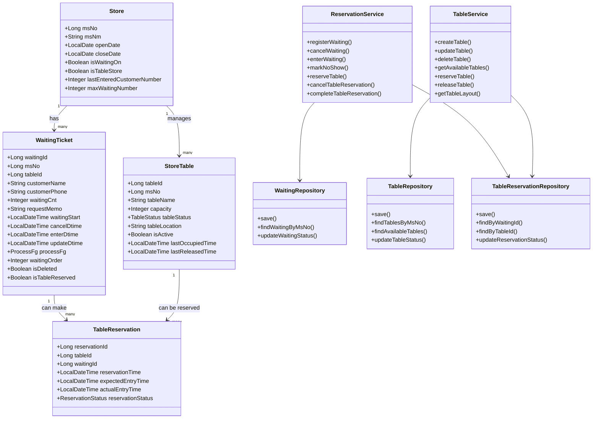

```mermaid
classDiagram
    class Store {
        +Long msNo
        +String msNm
        +LocalDate openDate
        +LocalDate closeDate
        +Boolean isWaitingOn
        +Boolean isTableStore
        +Integer lastEnteredCustomerNumber
        +Integer maxWaitingNumber
    }

    class WaitingTicket {
        +Long waitingId
        +Long msNo
        +Long tableId
        +String customerName
        +String customerPhone
        +Integer waitingCnt
        +String requestMemo
        +LocalDateTime waitingStart
        +LocalDateTime cancelDtime
        +LocalDateTime enterDtime
        +LocalDateTime updateDtime
        +ProcessFg processFg
        +Integer waitingOrder
        +Boolean isDeleted
        +Boolean isTableReserved
    }

    class StoreTable {
        +Long tableId
        +Long msNo
        +String tableName
        +Integer capacity
        +TableStatus tableStatus
        +String tableLocation
        +Boolean isActive
        +LocalDateTime lastOccupiedTime
        +LocalDateTime lastReleasedTime
    }

    class TableReservation {
        +Long reservationId
        +Long tableId
        +Long waitingId
        +LocalDateTime reservationTime
        +LocalDateTime expectedEntryTime
        +LocalDateTime actualEntryTime
        +ReservationStatus reservationStatus
    }

    class ReservationService {
        +registerWaiting()
        +cancelWaiting()
        +enterWaiting()
        +markNoShow()
        +reserveTable()
        +cancelTableReservation()
        +completeTableReservation()
    }

    class TableService {
        +createTable()
        +updateTable()
        +deleteTable()
        +getAvailableTables()
        +reserveTable()
        +releaseTable()
        +getTableLayout()
    }

    class WaitingRepository {
        +save()
        +findWaitingByMsNo()
        +updateWaitingStatus()
    }

    class TableRepository {
        +save()
        +findTablesByMsNo()
        +findAvailableTables()
        +updateTableStatus()
    }

    class TableReservationRepository {
        +save()
        +findByWaitingId()
        +findByTableId()
        +updateReservationStatus()
    }

    Store "1" --> "many" WaitingTicket : has
    Store "1" --> "many" StoreTable : manages
    WaitingTicket "1" --> "many" TableReservation : can make
    StoreTable "1" --> "many" TableReservation : can be reserved
    
    ReservationService --> WaitingRepository
    TableService --> TableRepository
    ReservationService --> TableReservationRepository
    TableService --> TableReservationRepository
```