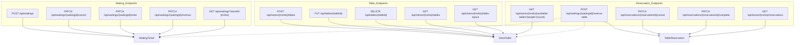

```mermaid
flowchart TD
    subgraph Waiting_Endpoints
        CreateWaiting["POST /api/waitings"]
        CancelWaiting["PATCH /api/waitings/{waitingId}/cancel"]
        EnterWaiting["PATCH /api/waitings/{waitingId}/enter"]
        MarkNoShow["PATCH /api/waitings/{waitingId}/noshow"]
        GetCurrentWaitings["GET /api/waitings?storeId={msNo}"]
    end

    subgraph Table_Endpoints
        CreateTable["POST /api/stores/{msNo}/tables"]
        UpdateTable["PUT /api/tables/{tableId}"]
        DeleteTable["DELETE /api/tables/{tableId}"]
        GetStoreTables["GET /api/stores/{msNo}/tables"]
        GetTableLayout["GET /api/stores/{msNo}/table-layout"]
    end

    subgraph Reservation_Endpoints
        ReserveTable["POST /api/waitings/{waitingId}/reserve-table"]
        CancelReservation["PATCH /api/reservations/{reservationId}/cancel"]
        CompleteReservation["PATCH /api/reservations/{reservationId}/complete"]
        GetReservations["GET /api/stores/{msNo}/reservations"]
        GetAvailableTables["GET /api/stores/{msNo}/available-tables?people={count}"]
    end

    CreateWaiting --> WaitingTicket
    CancelWaiting --> WaitingTicket
    EnterWaiting --> WaitingTicket
    MarkNoShow --> WaitingTicket
    GetCurrentWaitings --> WaitingTicket

    CreateTable --> StoreTable
    UpdateTable --> StoreTable
    DeleteTable --> StoreTable
    GetStoreTables --> StoreTable
    GetTableLayout --> StoreTable

    ReserveTable --> TableReservation
    CancelReservation --> TableReservation
    CompleteReservation --> TableReservation
    GetReservations --> TableReservation
    GetAvailableTables --> StoreTable

    ReserveTable -.-> WaitingTicket
    ReserveTable -.-> StoreTable
```