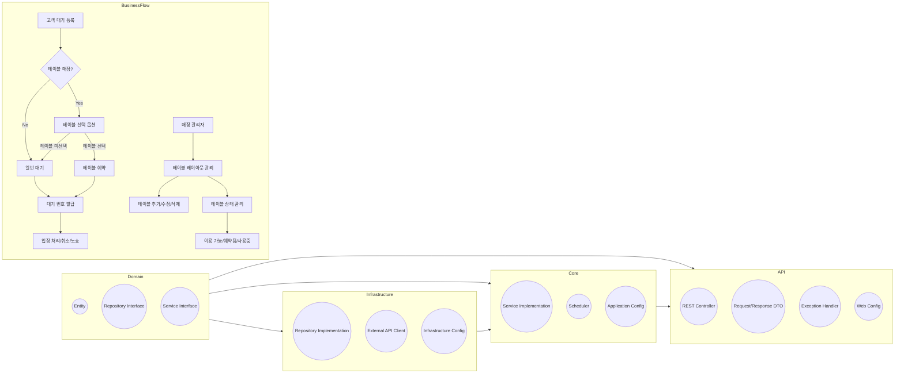

```mermaid
flowchart LR
    Domain[Domain Module]
    Infrastructure[Infrastructure Module]
    Core[Core Module]
    API[API Module]

    Domain --> Infrastructure
    Domain --> Core
    Domain --> API
    Infrastructure --> Core
    Core --> API

    subgraph Domain
        Entity((Entity))
        Repository((Repository Interface))
        Service((Service Interface))
    end

    subgraph Infrastructure
        RepositoryImpl((Repository Implementation))
        ExternalClient((External API Client))
        InfraConfig((Infrastructure Config))
    end

    subgraph Core
        CoreService((Service Implementation))
        CoreScheduler((Scheduler))
        CoreConfig((Application Config))
    end

    subgraph API
        Controller((REST Controller))
        DTO((Request/Response DTO))
        APIException((Exception Handler))
        APIConfig((Web Config))
    end

    subgraph BusinessFlow
        direction TB
        A[고객 대기 등록] --> B{테이블 매장?}
        B -->|No| C[일반 대기]
        B -->|Yes| D[테이블 선택 옵션]
        D -->|테이블 선택| E[테이블 예약]
        D -->|테이블 미선택| C
        C --> F[대기 번호 발급]
        E --> F
        F --> G[입장 처리/취소/노쇼]
        
        H[매장 관리자] --> I[테이블 레이아웃 관리]
        I --> J[테이블 추가/수정/삭제]
        I --> K[테이블 상태 관리]
        K --> L[이용 가능/예약됨/사용중]
    end
```