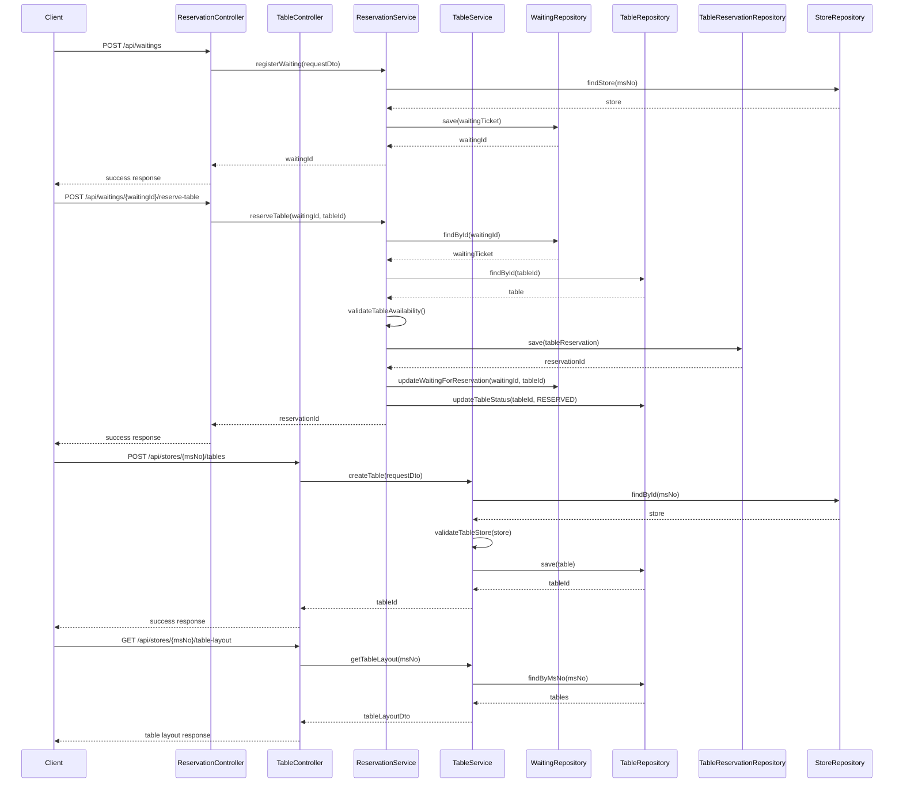

```mermaid
sequenceDiagram
    participant Client
    participant ReservationController
    participant TableController
    participant ReservationService
    participant TableService
    participant WaitingRepository
    participant TableRepository
    participant TableReservationRepository
    participant StoreRepository

    %% 대기 등록 시나리오
    Client->>ReservationController: POST /api/waitings
    ReservationController->>ReservationService: registerWaiting(requestDto)
    ReservationService->>StoreRepository: findStore(msNo)
    StoreRepository-->>ReservationService: store
    ReservationService->>WaitingRepository: save(waitingTicket)
    WaitingRepository-->>ReservationService: waitingId
    ReservationService-->>ReservationController: waitingId
    ReservationController-->>Client: success response

    %% 테이블 예약 시나리오 (테이블 매장인 경우)
    Client->>ReservationController: POST /api/waitings/{waitingId}/reserve-table
    ReservationController->>ReservationService: reserveTable(waitingId, tableId)
    ReservationService->>WaitingRepository: findById(waitingId)
    WaitingRepository-->>ReservationService: waitingTicket
    ReservationService->>TableRepository: findById(tableId)
    TableRepository-->>ReservationService: table
    ReservationService->>ReservationService: validateTableAvailability()
    ReservationService->>TableReservationRepository: save(tableReservation)
    TableReservationRepository-->>ReservationService: reservationId
    ReservationService->>WaitingRepository: updateWaitingForReservation(waitingId, tableId)
    ReservationService->>TableRepository: updateTableStatus(tableId, RESERVED)
    ReservationService-->>ReservationController: reservationId
    ReservationController-->>Client: success response

    %% 테이블 관리 시나리오
    Client->>TableController: POST /api/stores/{msNo}/tables
    TableController->>TableService: createTable(requestDto)
    TableService->>StoreRepository: findById(msNo)
    StoreRepository-->>TableService: store
    TableService->>TableService: validateTableStore(store)
    TableService->>TableRepository: save(table)
    TableRepository-->>TableService: tableId
    TableService-->>TableController: tableId
    TableController-->>Client: success response

    %% 테이블 레이아웃 조회 시나리오
    Client->>TableController: GET /api/stores/{msNo}/table-layout
    TableController->>TableService: getTableLayout(msNo)
    TableService->>TableRepository: findByMsNo(msNo)
    TableRepository-->>TableService: tables
    TableService-->>TableController: tableLayoutDto
    TableController-->>Client: table layout response
```