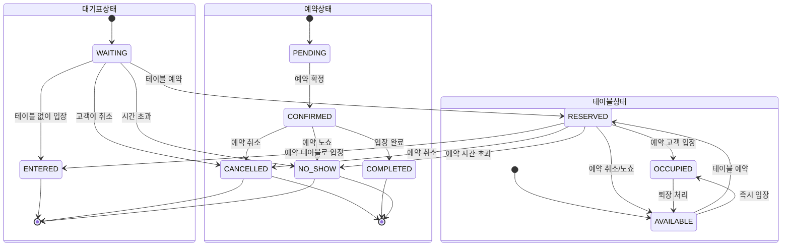

```mermaid
stateDiagram-v2
    state 대기표상태 {
        [*] --> WAITING
        WAITING --> RESERVED : 테이블 예약
        WAITING --> CANCELLED : 고객이 취소
        WAITING --> ENTERED : 테이블 없이 입장
        WAITING --> NO_SHOW : 시간 초과
        RESERVED --> ENTERED : 예약 테이블로 입장
        RESERVED --> CANCELLED : 예약 취소
        RESERVED --> NO_SHOW : 예약 시간 초과
        CANCELLED --> [*]
        ENTERED --> [*]
        NO_SHOW --> [*]
    }

    state 테이블상태 {
        [*] --> AVAILABLE
        AVAILABLE --> RESERVED : 테이블 예약
        AVAILABLE --> OCCUPIED : 즉시 입장
        RESERVED --> OCCUPIED : 예약 고객 입장
        RESERVED --> AVAILABLE : 예약 취소/노쇼
        OCCUPIED --> AVAILABLE : 퇴장 처리
    }

    state 예약상태 {
        [*] --> PENDING
        PENDING --> CONFIRMED : 예약 확정
        CONFIRMED --> CANCELLED : 예약 취소
        CONFIRMED --> COMPLETED : 입장 완료
        CONFIRMED --> NO_SHOW : 예약 노쇼
        CANCELLED --> [*]
        COMPLETED --> [*]
        NO_SHOW --> [*]
    }
```