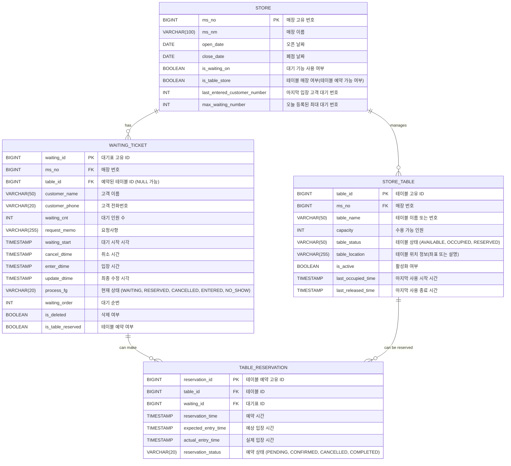

```mermaid
erDiagram

    STORE {
        BIGINT ms_no PK "매장 고유 번호"
        VARCHAR(100) ms_nm "매장 이름"
        DATE open_date "오픈 날짜"
        DATE close_date "폐점 날짜"
        BOOLEAN is_waiting_on "대기 기능 사용 여부"
        BOOLEAN is_table_store "테이블 매장 여부(테이블 예약 가능 여부)"
        INT last_entered_customer_number "마지막 입장 고객 대기 번호"
        INT max_waiting_number "오늘 등록된 최대 대기 번호"
    }

    WAITING_TICKET {
        BIGINT waiting_id PK "대기표 고유 ID"
        BIGINT ms_no FK "매장 번호"
        BIGINT table_id FK "예약된 테이블 ID (NULL 가능)"
        VARCHAR(50) customer_name "고객 이름"
        VARCHAR(20) customer_phone "고객 전화번호"
        INT waiting_cnt "대기 인원 수"
        VARCHAR(255) request_memo "요청사항"
        TIMESTAMP waiting_start "대기 시작 시각"
        TIMESTAMP cancel_dtime "취소 시간"
        TIMESTAMP enter_dtime "입장 시간"
        TIMESTAMP update_dtime "최종 수정 시각"
        VARCHAR(20) process_fg "현재 상태 (WAITING, RESERVED, CANCELLED, ENTERED, NO_SHOW)"
        INT waiting_order "대기 순번"
        BOOLEAN is_deleted "삭제 여부"
        BOOLEAN is_table_reserved "테이블 예약 여부"
    }

    STORE_TABLE {
        BIGINT table_id PK "테이블 고유 ID"
        BIGINT ms_no FK "매장 번호"
        VARCHAR(50) table_name "테이블 이름 또는 번호"
        INT capacity "수용 가능 인원"
        VARCHAR(50) table_status "테이블 상태 (AVAILABLE, OCCUPIED, RESERVED)"
        VARCHAR(255) table_location "테이블 위치 정보(좌표 또는 설명)"
        BOOLEAN is_active "활성화 여부"
        TIMESTAMP last_occupied_time "마지막 사용 시작 시간"
        TIMESTAMP last_released_time "마지막 사용 종료 시간"
    }

    TABLE_RESERVATION {
        BIGINT reservation_id PK "테이블 예약 고유 ID"
        BIGINT table_id FK "테이블 ID"
        BIGINT waiting_id FK "대기표 ID"
        TIMESTAMP reservation_time "예약 시간"
        TIMESTAMP expected_entry_time "예상 입장 시간"
        TIMESTAMP actual_entry_time "실제 입장 시간"
        VARCHAR(20) reservation_status "예약 상태 (PENDING, CONFIRMED, CANCELLED, COMPLETED)"
    }

    STORE ||--o{ WAITING_TICKET : "has"
    STORE ||--o{ STORE_TABLE : "manages"
    WAITING_TICKET ||--o{ TABLE_RESERVATION : "can make"
    STORE_TABLE ||--o{ TABLE_RESERVATION : "can be reserved"
```